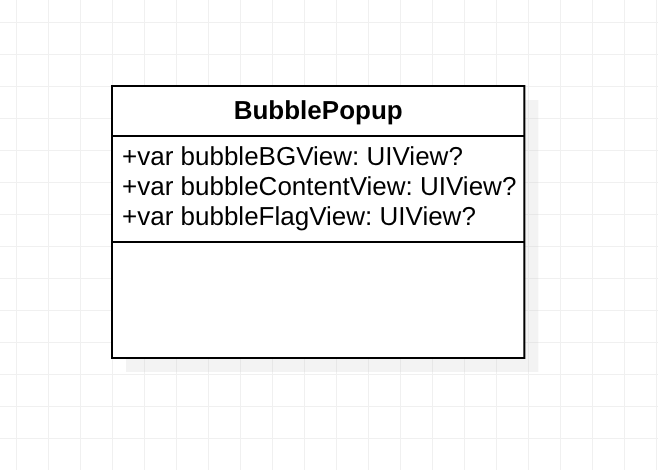
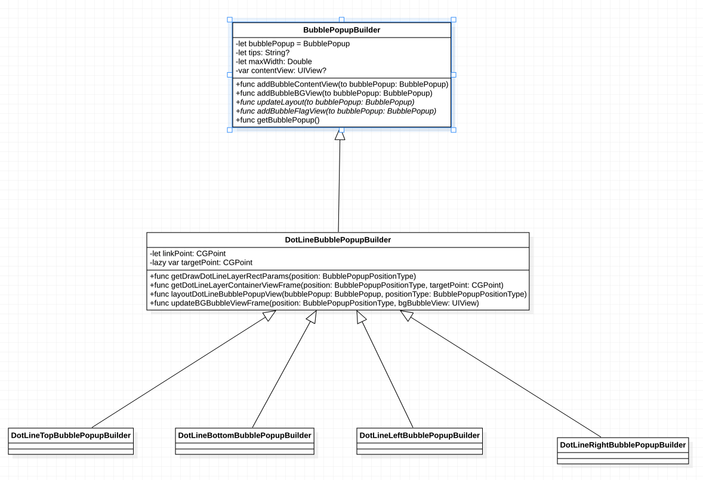
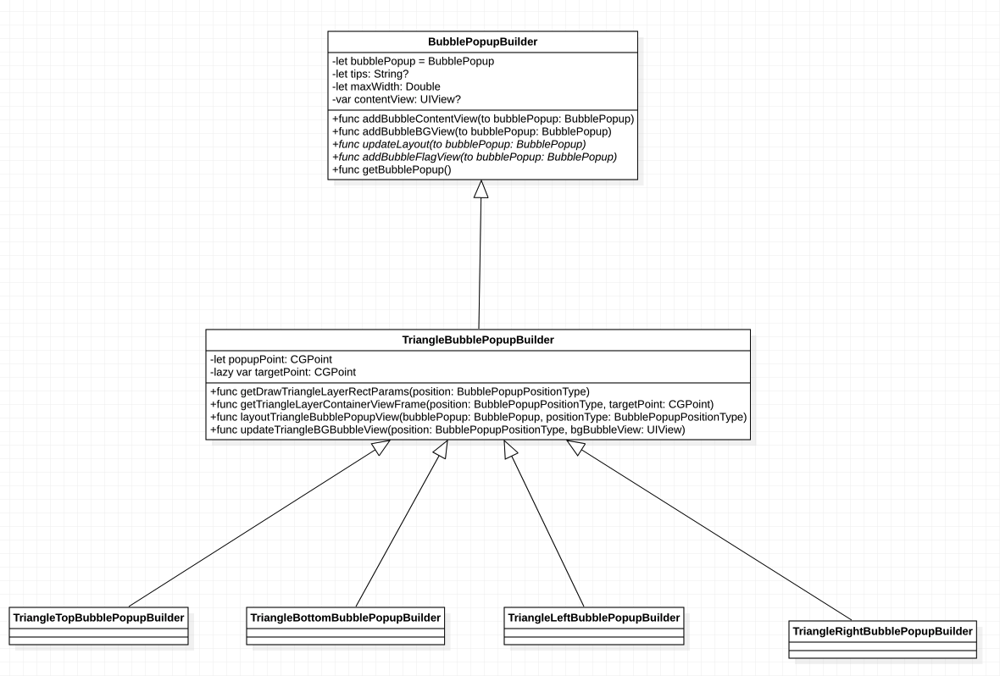
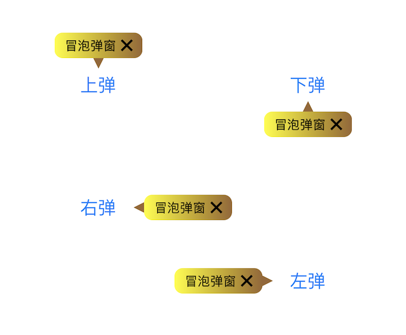
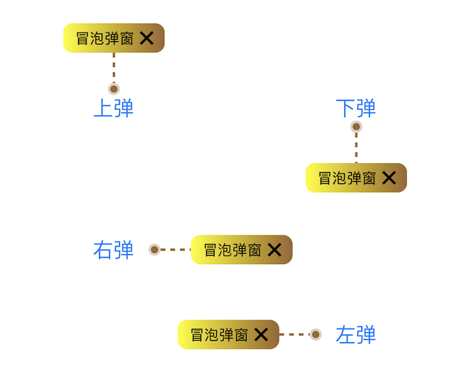
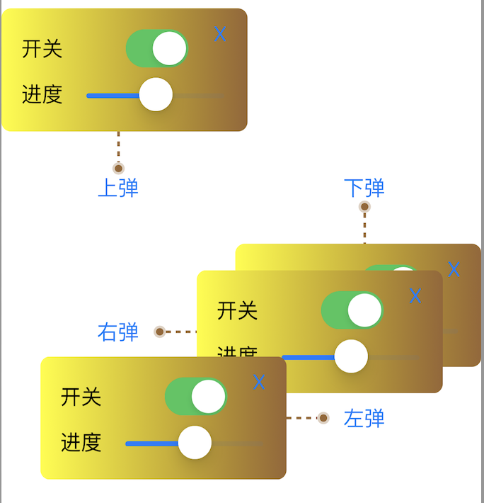

# BubblePopup
气泡弹框，气泡提示框，可用于新手引导，功能提示。

在平时的开发中，通常新手引导页或功能提示页会出现气泡弹窗来做提示。如果遇到了这类功能通常需要花费一定的精力来写这么一个工具的，这里写了一个气泡弹窗工具，希望能帮你提升一些开发效率。

#### 使用方法
1.从gitHub上下载代码到本地，代码地址：https://github.com/zhfei/BubblePopup。
2.调用BubblePopupManager文件内的单例方法，在指定的页面上添加气泡提示。
普通文本气泡弹窗使用方式如下：
```
BubblePopupManager.shared.addPopup(toView: self.view, tips: "冒泡弹窗", popupType: .dotLine, positionType: .bottom, popupPoint: nil, linkPoint: CGPoint(x: sender.frame.midX, y: sender.frame.minY), maxWidth: 200.0)

```
自定义View气泡弹窗使用方式如下：
```
BubblePopupManager.shared.addPopup(toView: self.view, customContentView: MyContentView(), popupType: .triangle, positionType: .bottom, popupPoint: CGPoint(x: sender.frame.midX, y: sender.frame.minY), linkPoint: nil, maxWidth: 200.0)
```
 注意：自定义内容View只能使用frame布局，不能使用约束。

#### 设计模式
**气泡弹窗View的结构设计采用的设计模式为组合模式**
把气泡弹窗分为3个部分：气泡背景，气泡指示器，气泡提示内容。
在创建气泡弹窗时，根据子类的自定义实现，将这三部分分别创建并组装到一起。实现了功能的灵活插拔和自定义扩展。
##### 气泡弹窗View类图

**气泡弹窗生成算法采用的设计模式为模版方法模式**
在气泡构建基类中设置好气泡的构建步骤，把必要的部分或者提供默认实现的部分在父类中提供默认的实现，对其他需要自定义实现的部分，只在父类中写了一个抽象方法，具体实现交给子类自己实现。
##### 虚线气泡弹窗类图

##### 三角形气泡弹窗类图


#### 核心实现
**BubblePopupManager：** 使用气泡弹窗工具的入口，通过它创建并添加一个气泡弹窗到指定的View上。
**BubblePopupBuilder：** 气泡弹窗构建者基类，使用模版方法模式定义了气泡的构建流程，子类可以自定义各自的实现。
**DotLineBubblePopupBuilder：**虚线气泡弹窗基类，它是基类BubblePopupBuilder的子类，内部包含了虚线气泡弹窗生成时所需要的工具方法和必要属性，方便创建top,bottom,left,right虚线气泡弹窗。
**TriangleBubblePopupBuilder ：**三角形气泡弹窗基类，它是BubblePopupBuilder的子类，内部包含了三角形气泡弹窗生成时所需要的工具方法和必要属性，方便创建top,bottom,left,right三角形气泡弹窗
**BubblePopup：**气泡弹窗View，它内部使用组合模式将子部件组合起来，组成了一个气泡弹窗。
**BubbleViewFactory：** 气泡弹窗子视图创建工程，用于创建气泡弹窗所需要的子视图,并将各个子视图组装成一个最终的气泡弹窗。

##### BubblePopupBuilder
BubblePopupBuilder是所有气泡弹窗的公共基类，对于里面定义的属性和方法的功能分别为
属性：属性里保存的是气泡弹窗公共的，必要的数据。
方法：在基类提供的方法中主要用于定义气泡的构建流程。
核心方法如下：
```
func setupUI() {
    addBubbleContentView(to: bubblePopup)
    addBubbleBGView(to: bubblePopup)
    updateLayout(to: bubblePopup)
    addBubbleFlagView(to: bubblePopup)
}
```
其中气泡内容展示视图和气泡背景视图有默认实现，子类可以直接使用默认样式。
而气泡标识View和气泡布局方法则需要子类自己实现，因为不同类型的气泡弹窗它们的气泡标识设布局方式是不一样的。

##### DotLineBubblePopupBuilder
虚线气泡基类DotLineBubblePopupBuilder，它继承自BubblePopupBuilder
属性：增加了虚线弹窗必要的linkPoint属性，即：虚线与气泡弹窗的连接点。
增加了一个坐标系转换懒加载属性，用于将用户设置的屏幕坐标点转成气泡内部的视图坐标系中的点。
重要方法说明：
```
getDrawDotLineLayerRectParams
```
用于虚线图层绘制：获取虚线绘制时所需要的绘制元素坐标，如：虚线的开始，结束坐标，连接点圆的直径等。

```
getDotLineLayerContainerViewFrame
```
更新虚线容器View的位置大小信息：获取不同情况下的虚线容器Frame。
```
layoutDotLineBubblePopupView
```
更新虚线气泡弹窗的frame。
```
updateBGBubbleViewFrame
```
更新气泡背景的frame。

这里提供的方法属于工具方法，子类可以通过传递自己的类型来得到对应的结果。这里按道理可以使用设计模式中策略模式来对算法进行封装，如：在基类定义一个抽象方法，将上面则4个工具方法分拆到各自的子类中，让子类在对应的自己的类中实现这个方法。
这里没有这样做原因是：这些方法在子类中的实现代码并不复杂，用一个方法根据条件集中返回是比较方便的，而分拆到不同类中反而很麻烦。所以选择在基类中以方法工具的形式统一放置了。

##### DotLineTopBubblePopupBuilder
top型虚线气泡弹窗DotLineTopBubblePopupBuilder，它继承自DotLineBubblePopupBuilder，属于一直具体的弹窗类型。
它里面只对下面两个方法进行了重写，根据自己的类型进行子类个性化实现。
```
override func updateLayout
override func addBubbleFlagView
```
具体实现如下：
```
class DotLineTopBubblePopupBuilder: DotLineBubblePopupBuilder {
     
    override func updateLayout(to bubblePopup: BubblePopup) {
        layoutDotLineBubblePopupView(bubblePopup: bubblePopup, positionType: .top)
    }
     
    override func addBubbleFlagView(to bubblePopup: BubblePopup) {
        assert(!self.targetPoint.equalTo(.zero), "气泡提示点无效")
         
        let flagFrame = getDotLineLayerContainerViewFrame(position: .top, targetPoint: self.targetPoint)
        let params = getDrawDotLineLayerRectParams(position: .top)
        let flagBubbleView = BubbleViewFactory.generateDotLineBubbleFlagView(flagFrame: flagFrame, position: .top, params: params)
        bubblePopup.bubbleFlagView = flagBubbleView
        bubblePopup.addSubview(flagBubbleView)
    }
     
}
```
其他bottom, left, right类型相似。

##### TriangleBubblePopupBuilder
三角形气泡基类TriangleBubblePopupBuilder，它继承自BubblePopupBuilder
属性：相对于基类增加了popupPoint属性，它是三角形顶点指向的坐标点
增加了一个坐标系转换懒加载属性，用于将用户设置的屏幕坐标点转成气泡内部的视图坐标系中的点。
重要方法说明：
```
getDrawTriangleLayeyRectParams
```
为三角形图层绘制提供不同气泡类型所需要的绘制元素坐标，如：三角形的三个顶点。
```
getTriangleLayerContainerViewFrame
```
获取不同情况下三角形图层容器的Frame，用于更新三角形图层容器View的位置大小。
```
layoutTriangleBubblePopupView
```
更新三角形气泡弹窗的frame。
```
updateTriangleBGBubbleView
```
更新气泡背景的frame。

三角形弹窗基类TriangleBubblePopupBuilder的设计方式和虚线弹窗基类是一样的。
这里的方法属于工具方法，子类可以通过传递自己的类型来得到对应的结果，通过牺牲一点开发模式的规范化来换取开发效率的提升。
在三角形气泡基类的下面同样有4个子类top,bottom,left ,right进行各种的自定义实现。

##### TriangleTopBubblePopupBuilder
top型三角形气泡弹窗DotLineTopBubblePopupBuilder，它继承自DotLineBubblePopupBuilder，属于一直具体的弹窗类型。

它里面只对下面这两个方法做了重写，根据自己的类型进行子类个性化实现。
```
override func updateLayout
override func addBubbleFlagView
```
具体实现如下：
```
class TriangleTopBubblePopupBuilder: TriangleBubblePopupBuilder {
    override func updateLayout(to bubblePopup: BubblePopup) {
        layoutTriangleBubblePopupView(bubblePopup: bubblePopup, positionType: .top)
    }
    override func addBubbleFlagView(to bubblePopup: BubblePopup) {
        assert(!self.targetPoint.equalTo(.zero), "气泡提示点无效")
         
        let flagFrame = getTriangleLayerContainerViewFrame(position: .top, targetPoint: self.targetPoint)
        let params = getDrawTriangleLayeyRectParams(position: .top)
        let flagBubbleView = BubbleViewFactory.generateTriangleBubbleFlagView(flagFrame: flagFrame, position: .top, params: params)
        bubblePopup.bubbleFlagView = flagBubbleView
        bubblePopup.addSubview(flagBubbleView)
    }
}
```
其他bottom, left, right类型相似。

#### 弹窗效果展示

##### 三角形气泡弹窗


##### 虚线气泡弹窗


##### 自定义气泡弹窗



